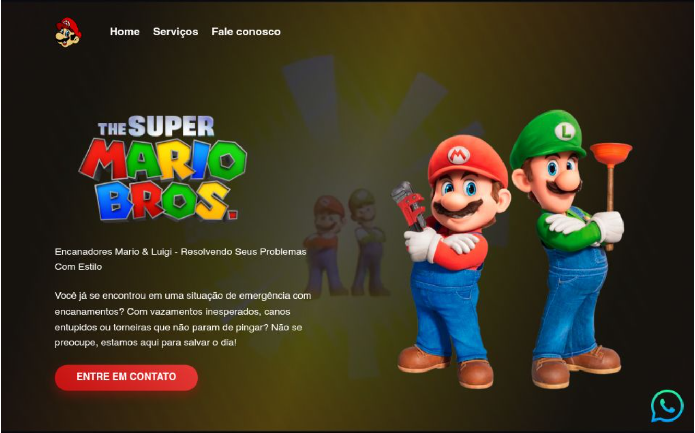

# 👨‍🔧 Mario e Luigi Encanadores - Landing Page

> Uma landing page temática e divertida desenvolvida para praticar conceitos de posicionamento, responsividade e estilização visual.

## 🔗 Demonstração
**Veja o projeto online:** [Acesse aqui](https://encanador.vercel.app/)

---

## 💻 Sobre o Projeto
Este projeto foi focado em transformar elementos visuais temáticos em uma interface comercial funcional. O desafio foi alinhar a estética do universo Mario Bros com as boas práticas de desenvolvimento front-end, garantindo uma navegação intuitiva e um layout atraente.

## 🛠️ Tecnologias Utilizadas
- **HTML5:** Estruturação semântica.
- **CSS3:** Estilização, Flexbox e efeitos visuais.
- **JavaScript:** Lógica de interação com o usuário.
- **Vercel:** Deploy e hospedagem.

## 🎨 Diferenciais Técnicos
- **Fidelidade Visual:** Aplicação de cores e elementos que respeitam a identidade visual do tema.
- **Mobile First:** Planejado para oferecer uma boa experiência em dispositivos móveis.
- **Call to Action:** Foco em conversão através do formulário de contato.

## 📸 Preview

---
### 👨‍💻 Contato
**Matheus Rodrigues** [LinkedIn](https://www.linkedin.com/in/matheus-rodrigues-4398423b9) | [GitHub](https://github.com/mathrodriguesdev-arch)
